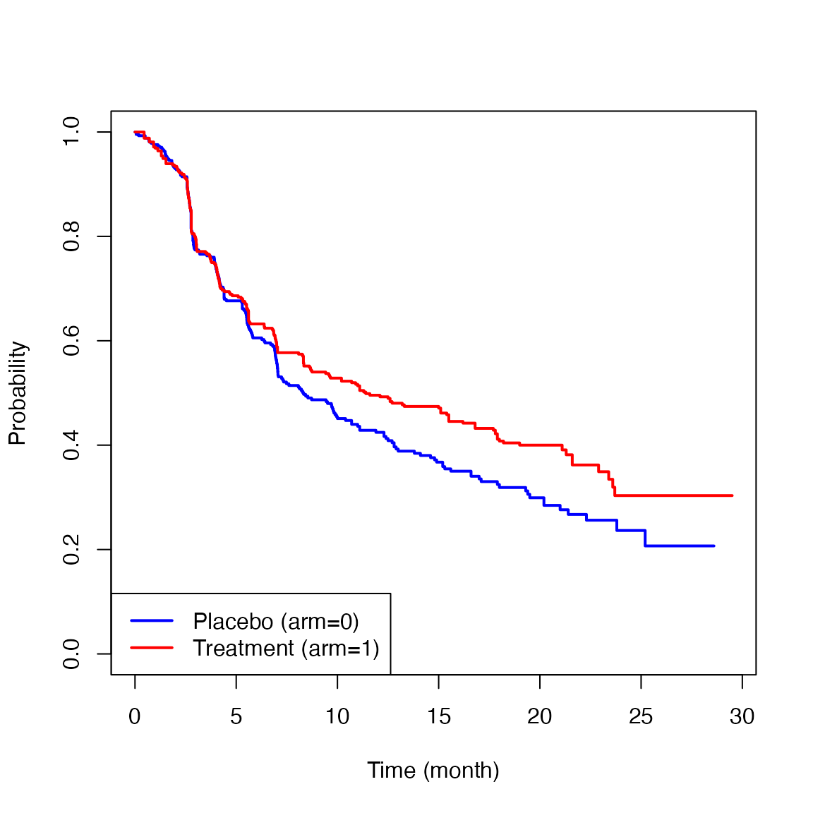
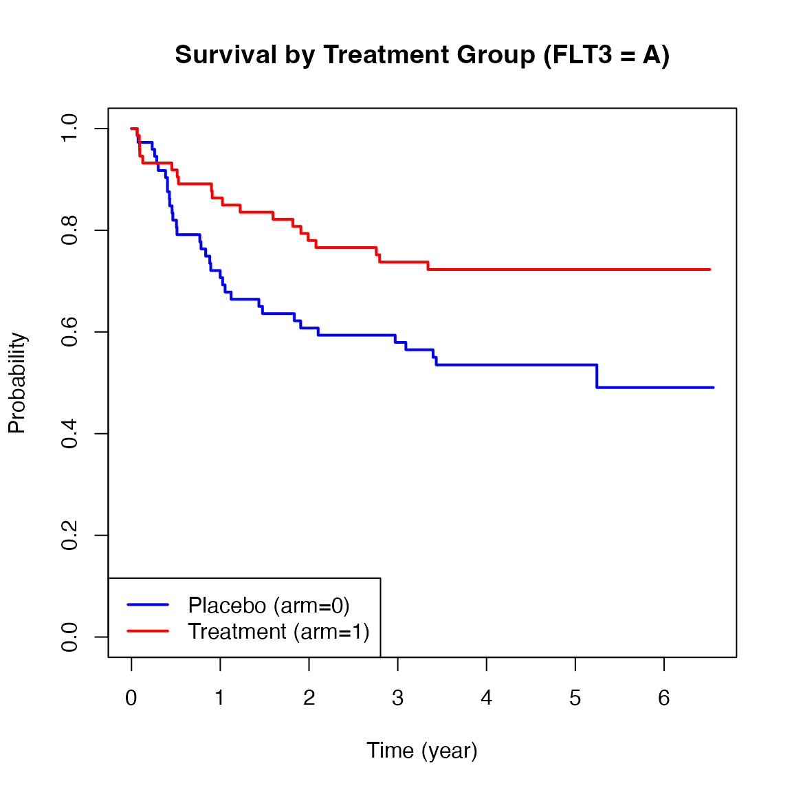
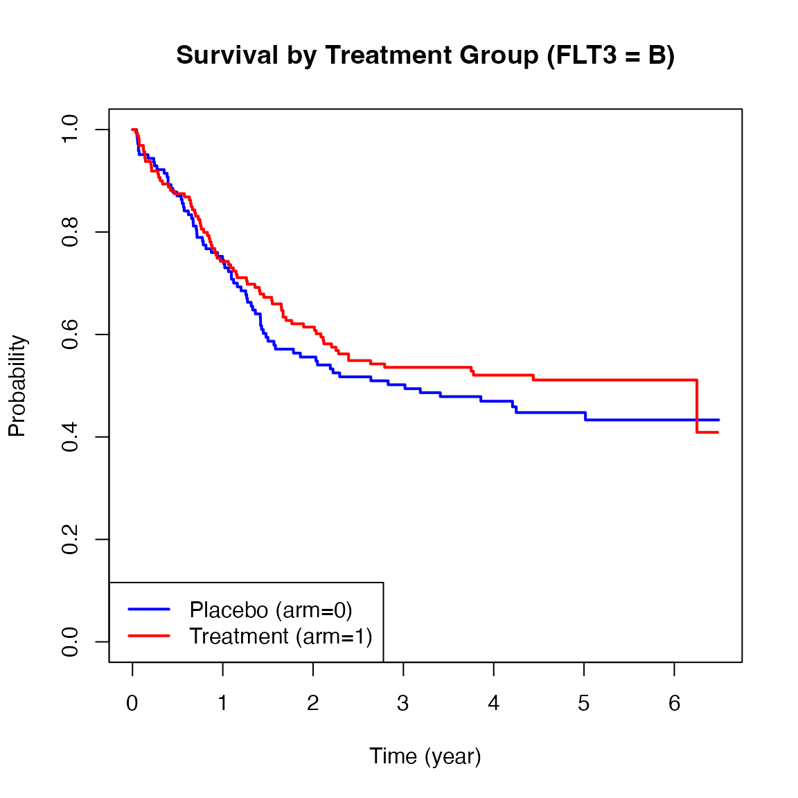
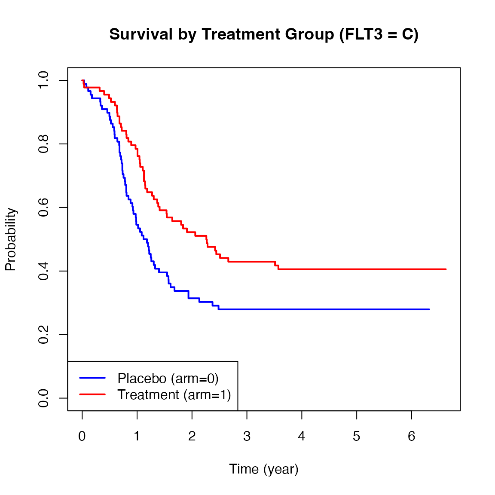
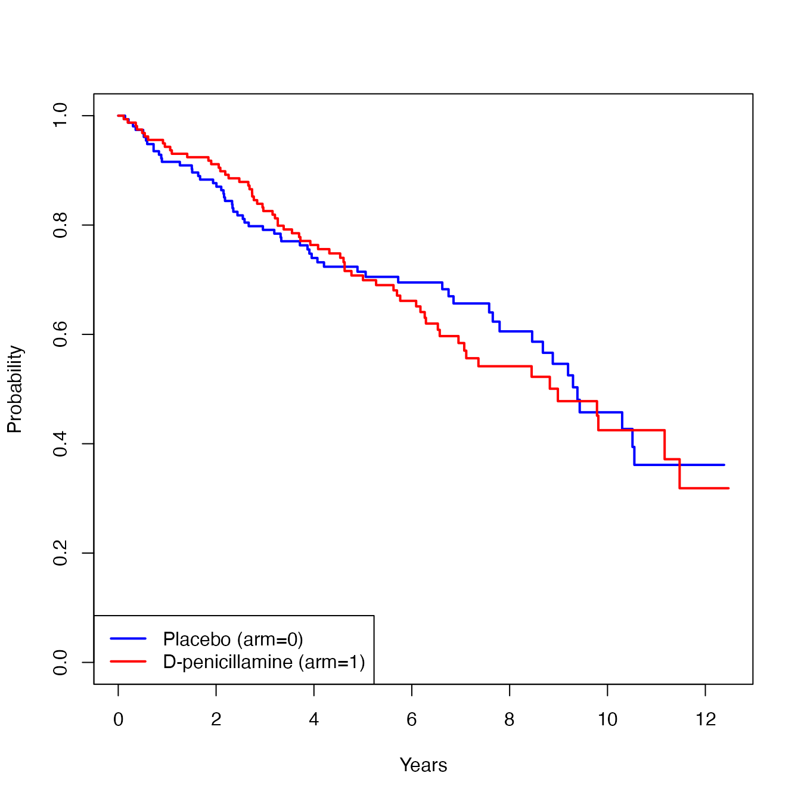

# Vignette for survAH package

## 1 Introduction

An important objective of clinical research investigating the safety and
efficacy of a new intervention is to provide quantitative information
about the intervention effect on clinical outcomes. Such quantitative
information is critical for informed treatment decision making to
balance the risks and benefits of the new intervention. In those studies
where time-to-event outcomes are clinical endpoints of interest, the
traditional Cox’s hazard ratio (HR) has been used for estimating and
reporting the treatment effect magnitude for many decades. However, this
traditional approach may not have provided the sufficient quantitative
information that is needed for informed decision making in clinical
practice for the following reasons. First, this approach does not
require calculating the absolute hazard in each group in order to
calculate the HR, which is a desirable feature from a statistical point
of view, but which makes the clinical interpretation difficult. From the
clinical point of view, the two numbers from the treatment and control
groups are necessary for interpreting a between-group contrast measure
(e.g., difference or ratio). Second, if the proportional hazards
assumption is not correct, the interpretation of HR is not obvious
because it is affected by the underlying study-specific censoring time
distribution.\[1,2\]

The average hazard with survival weight (AHSW), which can be interpreted
as the general censoring-free incidence rate (CFIR), is a summary
measure of the event time distribution and does not depend on the
underlying study-specific censoring time distribution. The approach
using AHSW (or CFIR) provides two numbers from the treatment and control
groups and allows us to summarize the treatment effect magnitude in both
absolute and relative terms, which would enhance the clinical
interpretation of the treatment effect on time-to-event
outcomes.\[3,4,5,6\]

This vignette is a supplemental documentation for the *survAH* package
and illustrates how to use the functions in the package to compare two
groups with respect to the AHSW (or CFIR). The package was made and
tested on R version 4.5.2.

## 2 Installation

Open the R or RStudio applications. Then, copy and paste either of the
following scripts to the command line.

To install the package from the CRAN:

``` r
install.packages("survAH")
```

To install the development version:

``` r
install.packages("devtools") #-- if the devtools package has not been installed
devtools::install_github("uno1lab/survAH")
```

## 2 Sample Reconstructed Data

We use sample reconstructed data of the CheckMate214 study reported by
Motzer et al. \[7\]. The data consists of 847 patients with previously
untreated clear-cell advanced renal-cell carcinoma; 425 for the
nivolumab plus ipilimumab group (treatment) and 422 for the sunitinib
group (control).

The sample reconstructed data of the CheckMate214 study is available on
*survAH* package as *cm214_pfs*. To load the data, copy and paste the
following scripts to the command line.

``` r
library(survAH)

nrow(cm214_pfs)
#> [1] 847

head(cm214_pfs)
#>    time status arm
#> 1 0.451      1   1
#> 2 0.451      1   1
#> 3 0.451      1   1
#> 4 0.451      1   1
#> 5 0.451      1   1
#> 6 0.710      1   1
```

Here, **time** is months from the registration to progression-free
survival (PFS), **status** is the indicator of the event (1: event, 0:
censor), and **arm** is the treatment assignment indicator (1: Treatment
group, 0: Control group).

Below are the Kaplan-Meier estimates for the PFS for each treatment
group.



The two survival curves showed similar trajectories up to six months,
but after that, a difference appeared between the two groups. This is
the so-called delayed difference pattern often seen in immunotherapy
trials. The HR based on the traditional Cox’s method was 0.82 (0.95CI:
0.68 to 0.99, p-value=0.037). Since the validity of the proportional
hazards assumption was not clear in this study, there is no clear
interpretation on the reported HR. Even if the proportional hazards
assumption seemed to be reasonable, the lack of a group-specific
absolute value regarding hazard makes the clinical interpretation of the
treatment effect difficult. For example, if the baseline absolute hazard
is very low, the reported HR (0.82) may indicate a clinically ignorable
treatment effect magnitude. If it is high, even an HR that is closer to
1 (e.g., 0.98) may indicate a clinically significant treatment effect
magnitude.

## 3 Average Hazard with Survival Weight (AHSW)

For a given $`\tau,`$ a general form of the average hazard (AH) is
denoted by
``` math
 \eta(t) = \frac{\int_0^\tau h(u)w(u)du}{\int_0^\tau w(u)du},
```
where $`h(t)`$ and $`w(t)`$ are the hazard function for the event time
$`T,`$ and a non-negative weight function, respectively. Let $`S(t)`$ be
the survival function for $`T.`$ We use $`S(t)`$ as the weight, which
gives the AHSW
``` math
 \eta(t) = \frac{\int_0^\tau h(u)S(u)du}{\int_0^\tau S(u)du}.
```
The detailed motivation for using $`S(t)`$ as $`w(t)`$ was discussed in
Uno and Horiguchi (2023) \[3\]. The AHSW has a clear interpretation as
the average person-time incidence rate on a given time window
$`[0,\tau].`$ It can also be called as the general censoring-free
incidence rate (CFIR) in contrast to the conventional person-time
incidence rate that potentially depends on an underlying study-specific
censoring time distribution.

From now on, we simply call the AHSW (or CFIR) the average hazard (AH).
The AH is denoted by the ratio of cumulative incidence probability and
restricted mean survival time at $`\tau < \infty`$:
``` math
 \eta(\tau) = \frac{1-S(\tau)}{\int_0^\tau S(t)dt}.
```

Let $`\widehat{S}(t)`$ denote the Kaplan-Meier estimator for $`S(t).`$ A
natural estimator for $`\eta(\tau)`$ is then given by  
``` math
 \widehat{\eta}(\tau) = \frac{1-\widehat{S}(\tau)}{\int_0^\tau {\widehat S} (t)dt}.
```
The large sample properties and a standard error formula of
$`\widehat{\eta}(\tau)`$ are given in Uno and Horiguchi (2023) \[3\].

## 4 Two-sample comparison using AH and its implementation

Let $`\eta_{1}(\tau)`$ and $`\eta_{0}(\tau)`$ denote the AH for
treatment group 1 and 0, respectively. Now, we compare the two survival
curves, using the AH. Specifically, we consider the following two
measures to capture the between-group contrast:

1.  Difference in AH (DAH)
    ``` math
     \eta_{1}(\tau) - \eta_{0}(\tau) 
    ```
2.  Ratio of AH (RAH)
    ``` math
     \eta_{1}(\tau) / \eta_{0}(\tau) 
    ```

These are estimated by simply replacing $`\eta_{1}(\tau)`$ and
$`\eta_{0}(\tau)`$ by their empirical counterparts (i.e.,
$`\widehat{\eta_{1}}(\tau)`$ and $`\widehat{\eta_{0}}(\tau)`$,
respectively). For the inference of the ratio type metrics, we use the
delta method to calculate the standard error. Specifically, we consider
$`\log \{ \widehat{\eta_{1}}(\tau)\}`$ and
$`\log \{ \widehat{\eta_{0}}(\tau)\}`$ and calculate the standard error
of log-AH. We then calculate a confidence interval for the log-ratio of
AH, and transform it back to the original ratio scale; the detailed
formula is given in Uno and Horiguchi (2023) \[3\].

The procedures below show how to use the function, **ah2**, to implement
these analyses.

``` r
time   = cm214_pfs$time
status = cm214_pfs$status
arm    = cm214_pfs$arm
```

``` r
ah2(time=time, status=status, arm=arm, tau=21)
```

The first argument (**time**) is the time-to-event vector variable. The
second argument (**status**) is also a vector variable with the same
length as **time**, each of the elements takes either 1 (if event) or 0
(if no event). The third argument (**arm**) is a vector variable to
indicate the assigned treatment of each subject; the elements of this
vector take either 1 (if the active treatment arm) or 0 (if the control
arm). The fourth argument (**tau**) is a scalar value to specify the
truncation time point $`{\tau}`$ for the AH calculation.

When $`\tau`$ is not specified in **ah2**, (i.e., when the code looks
like below)

``` r
ah2(time, status, arm)
```

the default $`\tau`$ (i.e., the maximum time point where the size of
risk set for both groups remains at least 10) is used to calculate the
AH. It is best to confirm that the size of the risk set is large enough
at the specified $`\tau`$ in each group to make sure the Kaplan-Meier
estimates are stable.

The **ah2** function returns AH on each group and the results of the
between-group contrast measures listed above. Note that we chose 21
months for $`\tau`$ in this example.

``` r
obj = ah2(time, status, arm, tau=21)
print(obj, digits=3)
#> 
#> The time window: [eta, tau] = [0, 21] was specified.
#> 
#> Number of observations: 
#>      Total N Event by tau Censor by tau At risk at tau
#> arm0     422          225           163             34
#> arm1     425          219           160             46
#> 
#> 
#> Average Hazard (AH) by arm: 
#>            Est. Lower 0.95 Upper 0.95
#> AH (arm0) 0.066      0.057      0.076
#> AH (arm1) 0.049      0.042      0.057
#> 
#> 
#> Between-group contrast: 
#>                                Est. Lower 0.95 Upper 0.95 P-value
#> Ratio of AH (arm1/arm0)       0.747      0.608      0.917   0.005
#> Difference of AH (arm1-arm0) -0.017     -0.029     -0.005   0.006
```

The estimated AHs were 0.049 (0.95CI: 0.042 to 0.057) and 0.066 (0.95CI:
0.057 to 0.076) for the treatment group and the control group,
respectively. The ratio and difference of AH were 0.747 (0.95CI: 0.608
to 0.917, p-value=0.005) and -0.017 (0.95CI: -0.029 to -0.005,
p-value=0.006), respectively.

## 5 Stratified analysis using the AH and its implementation

Stratified analysis is commonly used in clinical trials to adjust for
imbalanced baseline characteristics or known prognostic factors.
However, traditional stratified methods (e.g., Stratified Cox or CMH)
assume homogeneous effects across strata, which may not hold in
practice. To overcome this, we extend the AH framework to stratified
settings using standardization \[4\]. This approach adjusts for
stratification while preserving the interpretability of both absolute
and relative treatment effects.

In this framework, treatment effects are summarized using the adjusted
average hazard (AH), which is defined based on standardized survival
curves across strata:

``` math

\bar{S}_j(t) = \sum_{k=1}^{K} w_k S_{jk}(t),
```

where $`S_{jk}(t)`$ denotes survival function for group $`j`$ in stratum
$`k`$, and $`w_k`$ is aset of weights that satisfies
$`\sum_{k=1}^{K} w_k = 1`$ for $`K`$ strata. In this version of the
package, $`w_k`$ is set to be the proportion of subjects in stratum
$`k,`$ i.e., $`w_k = (n_{0k}+n_{1k}) / (n_0 + n_1)`$, where $`n_{jk}`$
is the number of subjects in stratum $`k`$ in the group $`j`$ and
$`n_j`$ is the total number of subjects in the group $`j.`$

Using this, the adjusted AH for group $`j`$ is defined as

``` math

\bar{\eta}_j(\tau) = \frac{1 - \bar{S}_j(\tau)}{\int_{0}^{\tau}\bar{S}_j(t)du}
= \frac{1 - \left\{\sum_{k=1}^{K} w_k S_{jk}(\tau)\right\}}{\int_0^\tau \left\{\sum_{k=1}^{K} w_k S_{jk}(u)\right\}du}.
```
We estimate $`\bar{\eta}_j(\tau)`$ by replacing survival functions with
Kaplan–Meier estimators $`\widehat{S}_{jk}(t).`$

``` math

\widehat{\bar{\eta}}_j(\tau) 
= \frac{1 - \left\{\sum_{k=1}^{K} w_k \widehat{S}_{jk}(\tau)\right\}}{\int_0^\tau \left\{\sum_{k=1}^{K} w_k \widehat{S}_{jk}(u)\right\}du}.
```

To compare two groups, we use the following contrast measures:
**Difference in AH (DAH)** is defined as
``` math

\text{DAH}(\tau) = \bar{\eta}_1(\tau) - \bar{\eta}_0(\tau),
```

and **Ratio of AH (RAH)** is defined as
``` math

\text{RAH}(\tau) = \frac{\bar{\eta}_1(\tau)}{\bar{\eta}_0(\tau)}.
```

Their estimators are
``` math

\widehat{\text{DAH}}(\tau) = \widehat{\bar{\eta}}_1(\tau) - \widehat{\bar{\eta}}_0(\tau), \quad 
\widehat{\text{RAH}}(\tau) = \frac{\widehat{\bar{\eta}}_1(\tau)}{\widehat{\bar{\eta}}_0(\tau)}.
```

We also illustrate how to perform stratified analysis using the AH with
the *myeloid* dataset from the *survival* package. This dataset
simulates a randomized trial in acute myeloid leukemia and includes a
stratification factor based on mutations of the FLT3 gene (levels A, B,
C), which is known to affect prognosis \[8\].

``` r
nrow(myeloid)
#> [1] 646
head(myeloid)
#>   id trt sex flt3 futime death txtime crtime rltime
#> 1  1   B   f    C    235     1     NA     44    113
#> 2  2   A   m    B    286     1    200     NA     NA
#> 3  3   A   f    A   1983     0     NA     38     NA
#> 4  4   B   f    A   2137     0    245     25     NA
#> 5  5   B   f    C    326     1    112     56    200
#> 6  6   B   f    C   2041     0    102     NA     NA

# Create new analysis variables:
# - arm_num: binary treatment indicator (1 = arm B [treatment], 0 = arm A [control])
# - time_yr: follow-up time converted from days to years
myeloid$arm_num <- ifelse(myeloid$trt == "B", 1, 0)
myeloid$time_yr <- myeloid$futime / 365.25
```

This data frame contains 646 observations and 9 variables. For the
current analysis, we focus on the following key variables: **futime**,
which represents the time to death or last follow-up; **death**, a
censoring indicator where 1 denotes death and 0 indicates censoring;
**trt**, the treatment variable with two levels, arm A and arm B; and
**flt3**, which represents the mutation burden of the FLT3 gene,
categorized as levels A, B, and C, and be used as a stratification
factor in our following analysis.

Below are Kaplan-Meier plots of survival stratified by FLT3 mutation
levels (A, B, C). These curves suggest potential heterogeneity in
treatment effects across strata.







We now apply the
[`ah2()`](https://www.uno1lab.com/survAH/reference/ah2.md) function from
the `survAH` package to conduct a stratified AH analysis with FLT3
mutation levels as the stratification factor.

``` r
myel_time   = myeloid$time_yr
myel_status = myeloid$death
myel_arm <- ifelse(myeloid$trt == "B", 1, 0) # Convert treatment variable to binary: 1 = treatment (arm B), 0 = control (arm A)
myel_strata = myeloid$flt3
```

``` r
ah2(time = myel_time,
    status = myel_status,
    arm = myel_arm,
    tau = 3,
    strata = myel_strata)
```

We set $`\tau`$ to 3 (years). Compared to the previous sections, the
other arguments remain the same, but we now introduce a new argument
**strata** to perform a stratified analysis. The **strata** argument
allows us to specify a categorical variable that defines the strata for
the analysis. In this case, we use the FLT3 mutation levels as the
stratification factor. The function will then report results from both
*unstratified* and *stratified* analyses.

``` r

myel_obj <- ah2(time = myel_time,
                status = myel_status,
                arm = myel_arm,
                tau = 3,
                strata = myel_strata)

print(myel_obj,digit = 3)
#> 
#> The time window: [eta, tau] = [0, 3] was specified.
#> 
#> Number of observations: 
#>         total arm0 arm1
#> strata1   149   74   75
#> strata2   319  154  165
#> strata3   178   89   89
#> total     646  317  329
#> 
#> 
#>      Total N Event by tau Censor by tau At risk at tau
#> arm0     317          160            28            129
#> arm1     329          142            18            169
#> 
#> 
#> <Unstratified analysis> Average Hazard (AH) by arm: 
#>            Est. Lower 0.95 Upper 0.95
#> AH (arm0) 0.290      0.245      0.343
#> AH (arm1) 0.207      0.175      0.246
#> 
#> 
#> <Unstratified analysis> Between-group contrast: 
#>                                Est. Lower 0.95 Upper 0.95 P-value
#> Ratio of AH (arm1/arm0)       0.715      0.563      0.910   0.006
#> Difference of AH (arm1-arm0) -0.082     -0.143     -0.022   0.007
#> 
#> 
#> <Stratified analysis> Average Hazard (AH) by arm: 
#>            Est. Lower 0.95 (orginal scale) Upper 0.95 (orginal scale)
#> AH (arm0) 0.286                      0.235                      0.337
#> AH (arm1) 0.207                      0.170                      0.243
#>           Lower 0.95 (based on log scale) Upper 0.95 (based on log scale)
#> AH (arm0)                           0.239                           0.342
#> AH (arm1)                           0.173                           0.247
#> 
#> 
#> <Stratified analysis> Between-group contrast: 
#>                                Est. Lower 0.95 Upper 0.95 P-value
#> Ratio of AH (arm1/arm0)       0.723      0.562      0.930   0.011
#> Difference of AH (arm1-arm0) -0.079     -0.142     -0.016   0.013
```

As shown in the **ah2** results above, in the unstratified analysis, the
estimated AHs were 0.290 (95% CI: 0.245 to 0.343) for the control group
and 0.207 (95% CI: 0.175 to 0.246) for the treatment group. The
estimated RAH was 0.715 (95% CI: 0.563 to 0.910, p = 0.006), and the DAH
was -0.082 (95% CI: -0.143 to -0.022, p = 0.007). In the stratified
analysis, which adjusts for FLT3 mutation subgroups, the AHs were 0.286
(95% CI: 0.235 to 0.337) for the control group and 0.207 (95% CI: 0.170
to 0.243) for the treatment group. The RAH was 0.723 (95% CI: 0.562 to
0.930, p = 0.011), and the DAH was -0.079 (95% CI: -0.142 to -0.016, p =
0.013).

## 6 Regression analysis for AH and its implementation

Sections 4 and 5 focused on two-sample comparisons of AH, with or
without stratification. In many clinical research, however, regression
models are frequently used to adjust for confounding factors,
investigate prognostic variables, and develop risk prediction models for
patient outcomes. Motivated by these needs, Uno et. al. (2024) proposed
a regression analysis framework for AH at a pre-specified truncation
time $`\tau`$.

The AH regression framework extends the two-sample AH comparison
presented in earlier sections by allowing investigators to adjust for
multiple covariates that may be associated with the outcome. With this
approach, one can summarize the between-group treatment difference in
both absolute (difference in AH) and relative (ratio of AH) terms, while
simultaneously adjusting for important baseline characteristics. This
improves the likelihood that the magnitude of the treatment effect is
correctly interpreted in clinical settings.

The **ahreg** function implements three versions of AH regression,
depending on assumptions about the censoring mechanism:

1.  **Independent censoring**  
2.  **Group-specific censoring**  
3.  **Covariate-dependent censoring**

Let $`\eta(\tau \mid \mathbf{X})`$ denote the AH at time $`\tau`$ for an
individual with covariate vector $`\mathbf{X} = (X_1,\ldots,X_p)^\top`$.
The **ahreg** function fits a regression model of the form
``` math

g\{\eta(\tau \mid \mathbf{X})\}
= \beta_0 + \beta_1 X_1 + \cdots + \beta_p X_p,
```
where $`g(\cdot)`$ is a link function. The current implementation
supports the following link functions:

- **log link**: $`g(x) = \log(x)`$ (default),  
- **identity link**: $`g(x) = x`$.

Under the log link, $`\exp(\beta_j)`$ represents the **ratio of AH
(RAH)** associated with a one-unit increase in covariate $`X_j`$,
adjusted for other covariates. Under the identity link, $`\beta_j`$
represents the **difference in AH** associated with a one-unit increase
in $`X_j`$, adjusted for other covariates. Further methodological
details and the large-sample properties of the estimator are described
in Uno et al. (2024) \[6\].

### 6.1 Example data

We illustrate the use of **ahreg** with a cleaned subset of the *pbc*
dataset from the *survival* package. The original dataset includes 418
patients, comprising both randomized and non-randomized cases. For this
vignette, we use the 312 patients who participated in the randomized
clinical trial (158 assigned to D-penicillamine and 154 to placebo). The
*survAH* package provides the helper function **ahreg.sample.data()**,
which extracts and prepares this subset for illustrating examples of AH
regression analysis.

``` r
D = ahreg.sample.data()
nrow(D)
#> [1] 312
head(D)
#>        time status arm      age edema bili albumin protime
#> 1  1.095140      1   1 58.76523   1.0 14.5    2.60    12.2
#> 2 12.320329      0   1 56.44627   0.0  1.1    4.14    10.6
#> 3  2.770705      1   1 70.07255   0.5  1.4    3.48    12.0
#> 4  5.270363      1   1 54.74059   0.5  1.8    2.54    10.3
#> 5  4.117728      0   0 38.10541   0.0  3.4    3.53    10.9
#> 6  6.852841      1   0 66.25873   0.0  0.8    3.98    11.0
```

Here, **time** is years from registration to death or last known alive;
**status** is the event indicator (1 = death, 0 = censored); and **arm**
is the treatment assignment indicator (1 = D-penicillamine, 0 =
placebo).

For baseline covariates, the dataset includes **age** (years), **edema**
(0 = no edema, 0.5 = untreated or successfully treated, 1 = edema
despite diuretic therapy), **bili** (serum bilirubin in mg/dl),
**albumin** (serum albumin in g/dl), and **protime** (standardized blood
clotting time).

Below is the KM estimate of time to death for each group.



In the following subsections, we illustrate how to model AH at
$`\tau = 7`$ using several of these covariates.

### 6.2 AH regression under independent censoring

The first application of **ahreg** assumes independent censoring:

``` r
a1 <- ahreg(Surv(time, status) ~ arm + edema + bili, 
            tau  = 7, 
            data = D)
```

The key arguments are: - **formula**: a survival formula with the
response `Surv(time, status)` on the left of a `~` operator and
covariates on the right.  
- **tau**: the truncation time $`\tau`$ at which AH is defined and
estimated.  
- **data**: a data frame containing variables referenced in the
formula.  
- **link**: the link function to be used, either `"log"` or `"identity"`
(default = `"log"`).  
- **conf.int**: the confidence level for constructing confidence
intervals (default = `0.95`).

The output provides coefficient estimates, standard errors, confidence
intervals, $`z`$-values, and two-sided p-values for each predictor.

``` r
print(a1, digits=3)
#> Call: ahreg() 
#> 
#> [1] "Link: log"
#> Surv(time, status) ~ arm + edema + bili
#> 
#>              Est    SE low_0.95 upp_0.95       Z     p
#> Intercept -3.413 0.203   -3.811   -3.015 -16.805 0.000
#> arm        0.297 0.217   -0.129    0.723   1.366 0.172
#> edema      1.389 0.357    0.690    2.087   3.895 0.000
#> bili       0.115 0.016    0.083    0.147   7.055 0.000
```

In this example, the estimated coefficient for **arm** is
$`\hat{\beta}_{\text{arm}} = 0.297`$. Under the log link, exponentiating
this value yields the ratio of AH:

``` math

\exp(\hat{\beta}_{\text{arm}}) \approx 1.34.
```
This result can be summarized as:

The adjusted ratio of AH was 1.34 (95% CI: 0.88, 2.06; p-value=0.172).

This indicates that, on average, the treatment group experienced a 34%
higher incidence rate of death than the placebo group over 7 years of
follow-up, after adjusting for **edema** and **bili**.

### 6.3 AH regression with group-specific censoring

When the underlying censoring distribution differs across treatment
groups, the assumption of independent censoring is no longer
appropriate. This situation may arise, for example, when follow-up
schedules or discontinuation patterns vary by treatment arm.

To address such **group-specific censoring**, the **cens_strata**
argument can be used. This option instructs **ahreg** to estimate the
censoring distribution separately within each specified group, enabling
valid AH estimation and regression even when censoring behavior differs
across treatment groups.

``` r
a2 = ahreg(Surv(time, status) ~ arm + edema + bili,
           tau         = 7,
           data        = D,
           cens_strata = "arm")
```

One can assign a variable name to **cens_strata** to indicate groups
with potentially different censoring distributions. Only one variable
can be specified (default = `NULL`).

As before, exponentiated coefficients under the log link yield the ratio
of AH, now adjusted for group-specific censoring mechanisms.

``` r
a2 = ahreg(Surv(time, status) ~ arm + edema + bili,
           tau         = 7,
           data        = D,
           cens_strata = "arm")

print(a2, digits = 3)
#> Call: ahreg() 
#> 
#> [1] "Link: log"
#> Surv(time, status) ~ arm + edema + bili
#> 
#>              Est    SE low_0.95 upp_0.95       Z     p
#> Intercept -3.406 0.207   -3.813   -3.000 -16.443 0.000
#> arm        0.278 0.229   -0.171    0.728   1.214 0.225
#> edema      1.392 0.358    0.690    2.093   3.890 0.000
#> bili       0.115 0.016    0.083    0.147   7.044 0.000
```

### 6.4 AH regression with covariate-dependent censoring

When censoring is believed to depend on multiple baseline covariates,
the **cens_covs** argument can be used. In this setting, a Cox model is
fitted to estimate the censoring distribution as a function of the
specified covariates.

``` r
a3 <- ahreg(Surv(time, status) ~ arm + edema + bili,
            tau       = 7,
            data      = D,
            cens_covs = c("arm", "edema"))
```

Here, one can specify a set of covariates for modeling the censoring
distribution via a Cox model using **cens_covs**. This argument accepts
a vector of variable names (default = `NULL`).

The resulting regression estimates account for covariate-dependent
censoring, providing a more flexible approach when the censoring
mechanism is complex.

``` r
print(a3, digits = 3)
#> Call: ahreg() 
#> 
#> [1] "Link: log"
#> Surv(time, status) ~ arm + edema + bili
#> 
#>              Est    SE low_0.95 upp_0.95       Z     p
#> Intercept -3.407 0.214   -3.827   -2.987 -15.893 0.000
#> arm        0.300 0.234   -0.158    0.758   1.283 0.199
#> edema      1.470 0.398    0.689    2.250   3.692 0.000
#> bili       0.113 0.017    0.079    0.147   6.488 0.000
```

Note that only one of `cens_strata` or `cens_covs` can be specified in
the **ahreg** function.

### 6.5 AH regression with the identity link

The choice of link function determines how the regression coefficients
are interpreted. To model absolute differences in AH rather than ratios,
the identity link can be used by setting `link = "identity"`.

``` r
a4 <- ahreg(Surv(time, status) ~ arm + edema + bili,
            tau       = 7,
            data      = D,
            cens_covs = c("arm", "edema"),
            link      = "identity")
```

Under the identity link, each coefficient $`\beta_j`$ represents the
absolute difference in AH associated with a one-unit increase in
covariate $`X_j`$.

``` r
print(a4, digits = 3)
#> Call: ahreg() 
#> 
#> [1] "Link: identity"
#> Surv(time, status) ~ arm + edema + bili
#> 
#>              Est    SE low_0.95 upp_0.95      Z     p
#> Intercept -0.001 0.012   -0.025    0.022 -0.115 0.909
#> arm        0.004 0.016   -0.027    0.036  0.275 0.783
#> edema      0.238 0.118    0.006    0.469  2.014 0.044
#> bili       0.026 0.005    0.017    0.035  5.492 0.000
```

In this example, a coefficient of $`0.004`$ for **arm** (95% CI: –0.027,
0.036; p-value=0.783) indicates that the AH in the treatment group is
0.004 units (death events per person-year) higher than in the placebo
group at $`\tau = 7`$, after adjusting for **edema** and **bili**.

This specification is useful when the primary focus is on the absolute
difference in AH.

## 7 Conclusions

As illustrated, the AH-based methods offer more robust and reliable
quantitative information than the traditional Cox hazard ratio approach
for analyzing time-to-event outcomes. We hope that the methods
implemented in the *survAH* package will assist clinical researchers in
quantifying treatment effects in a more transparent and interpretable
way, ultimately supporting better informed decision making in clinical
practice.

## References

\[1\] Uno H, Claggett B, Tian L, et al. Moving beyond the hazard ratio
in quantifying the between-group difference in survival analysis. J Clin
Oncol. 2014 Aug 1;32(22):2380-5. doi: 10.1200/JCO.2014.55.2208. Epub
2014 Jun 30. PMID: 24982461; PMCID: PMC4105489.

\[2\] Horiguchi M, Hassett MJ, Uno H. How Do the Accrual Pattern and
Follow-Up Duration Affect the Hazard Ratio Estimate When the
Proportional Hazards Assumption Is Violated? Oncologist. 2019
Jul;24(7):867-871. doi: 10.1634/theoncologist.2018-0141. Epub 2018 Sep
10. PMID: 30201741; PMCID: PMC6656438.

\[3\] Uno H, Horiguchi M. Ratio and difference of average hazard with
survival weight: New measures to quantify survival benefit of new
therapy. Stat Med. 2023 Mar 30;42(7):936-952. doi: 10.1002/sim.9651.
Epub 2023 Jan 5. PMID: 36604833.

\[4\] Qian Z, Tian L, Horiguchi M, Uno H. A Novel Stratified Analysis
Method for Testing and Estimating Overall Treatment Effects on
Time-To-Event Outcomes Using Average Hazard With Survival Weight. Stat
Med. 2025 Mar 30;44(7):e70056. doi: 10.1002/sim.70056. PMID: 40213923.

\[5\] Horiguchi M, Tian L, Kehl KL, Uno H. Assessing delayed treatment
benefits of immunotherapy using long-term average hazard: a novel
test/estimation approach. Lifetime Data Anal. 2025 Oct;31(4):784-809.
doi: 10.1007/s10985-025-09671-0. Epub 2025 Oct 14. PMID: 41085870;
PMCID: PMC12586407.

\[6\] Uno H, Tian L, Horiguchi M, Hattori S, Kehl KL. Regression models
for average hazard. Biometrics. 2024 Mar 27;80(2):ujae037. doi:
10.1093/biomtc/ujae037. PMID: 38771658; PMCID: PMC11107592.

\[7\] Motzer RJ, Tannir NM, McDermott DF, et al. Nivolumab plus
Ipilimumab versus Sunitinib in Advanced Renal-Cell Carcinoma. N Engl J
Med. 2018 Apr 5;378(14):1277-1290. doi: 10.1056/NEJMoa1712126. Epub 2018
Mar 21. PMID: 29562145; PMCID: PMC5972549.

\[8\] Le-Rademacher JG, Peterson RA, Therneau TM, Sanford BL, Stone RM,
Mandrekar SJ. Application of multi-state models in cancer clinical
trials. Clin Trials. 2018 Oct;15(5):489-498. doi:
10.1177/1740774518789098. Epub 2018 Jul 23. PMID: 30035644; PMCID:
PMC6133743.
